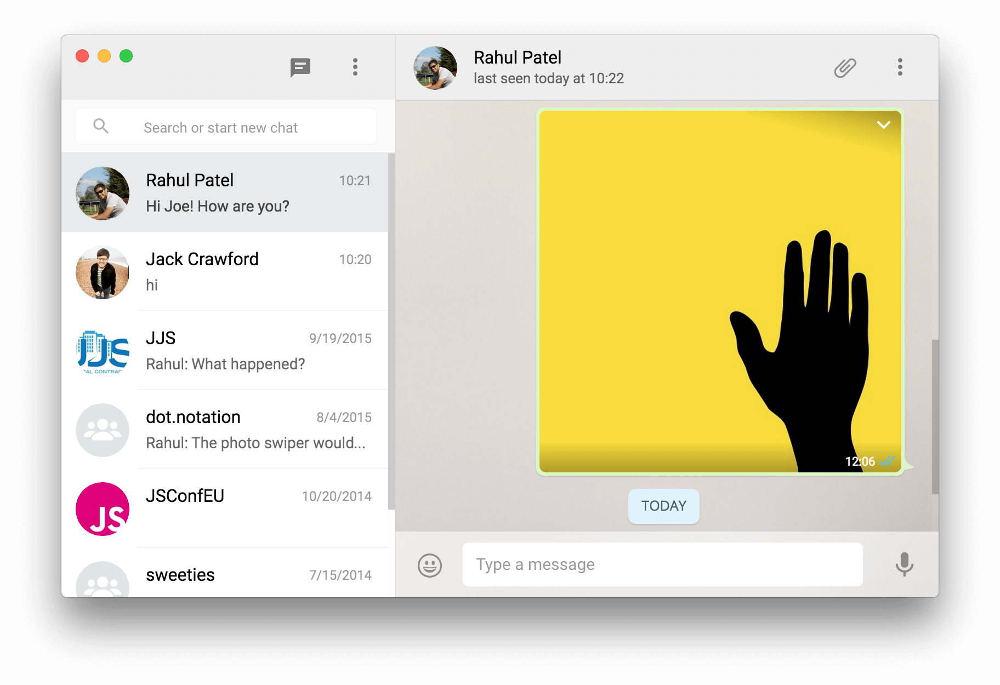

# &nbsp;Kamori

> Unofficial desktop WhatsApp app forked from Sindresorhus' brilliant [Caprine](https://github.com/sindresorhus/caprine)

 

## Install

*Requires OS X 10.8 or newer.*

### Manually

[**Download**](https://github.com/joezo/kamori/releases/latest), unzip, and move `Kamori.app` to the `/Applications` directory.

## Desktop notifications

Desktop notifications can be turned on in Preferences.

## Dev

Built with [Electron](http://electron.atom.io).

###### Commands

- Init: `$ npm install`
- Run: `$ npm start`
- Build: `$ npm run build`

## License

MIT © [Sindre Sorhus](http://sindresorhus.com)

## Thanks

This project is forked from sindresorhus' brilliant [Caprine](https://github.com/sindresorhus/caprine).
